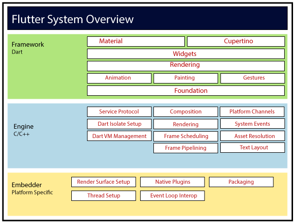
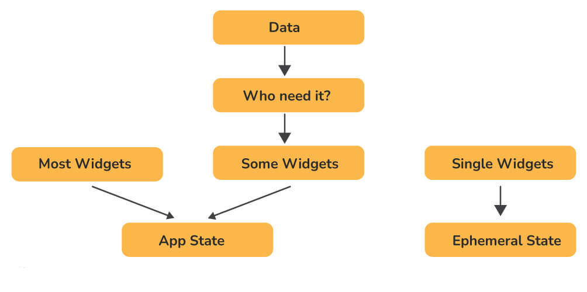

# Captions

- [What is OOP?](#what-is-oop)
- [Principles of OOP](#principles-of-oop)
- [Explain the Flutter Architecture?](#explain-the-flutter-architecture)
- [List some of the most important features of Flutter](#list-some-of-the-most-important-features-of-flutter)
- [What are different build modes in flutter?](#what-are-different-build-modes-in-flutter)
- [What are the types of widgets present in flutter?](#what-are-the-types-of-widgets-present-in-flutter)
- [Object in Flutter](#object-in-flutter)
- [Key features and importance of Dart](#key-features-and-importance-of-dart)
- [Data structures in Dart](#data-structures-in-dart)
- [Dart VM. How it works?](#dart-vm-how-it-works)
- [Explain App State](#explain-app-state)
- [Difference between `runApp` and `main()`](#difference-between-runapp-and-main)
- [Packages and plugins](#packages-and-plugins)
- [What are keys in Flutter?](#what-are-keys-in-flutter)
- [Explain different widgets](#explain-different-widgets)
- [What is the use of Ticker in Flutter?](#what-is-the-use-of-ticker-in-flutter)
- [Wht are DevTools](#wht-are-devtools)
- [What is the use of Mixins?](#what-is-the-use-of-mixins)
- [Extension methods in Dart](#extension-methods-in-dart)
- [What are Streams?](#what-are-streams)
- [Different type of Streams ](#different-type-of-streams)
- [Dart VM. How it works?](#dart-vm-how-it-works)
- [Difference between Hot reload and How restart](#difference-between-hot-reload-and-how-restart)
- [What is BuildContext?](#what-is-buildcontext)
- [Flutter Testing](#flutter-testing)
- [What is StateManagement?](#what-is-statemanagement)
- [What is the difference between Async and Isolates?](#what-is-the-difference-between-async-and-isolates)
- [Dependency Injection](#dependency-injection)
- [SOLID Principles](#solid-principles)
- [CUPID principles](#cupid-principles)
- [DRY Principle](#dry-principle)
- [Design Patterns](#design-patterns)
- [GRASP](#grasp)
- [Monolithic Architecture](#monolithic-architecture)
- [Microservices Architecture](#microservices-architecture)

# Additional Sources

- [Flutter Internals](docs/flutter_internals.md)
- [Dart Internals](docs/dart_internals.md)


## What is OOP?

Object oriented programming (OOP) is a style of programming characterized by the identification of classes of objects closely linked with the methods (functions) with which they are associated. It also includes ideas of inheritance of attributes and methods.

## Principles of OOP

The basic principles of OOP involves Abstraction, Encapsulation, Inheritance and Polymorphism.

- Abstraction means a concept or and Idea which is not associated with any particular instance. Using abstract class/Interface we express the intent of the class rather than the actual implementation. In a way, one class should not know the inner details of another in order to use it, just knowing the interfaces should be good enough.

- Encapsulation is the mechanism of hiding of data implementation by restricting access to public methods. Instance variables are kept private and accessor methods are made public to achieve this.

- Inheritance expresses "is-a" and/or "has-a" relationship between two objects. Using Inheritance, in derived classes we can reuse the code of existing super classes.

- Polymorphism means one name many forms. It is further of two types - static and dynamic. Static polymorphism is achieved using methods overloading and dynamic using overriding. It is closely related to inheritance. We can write a code that works on the superclass, and it will work with any subclass type as well.
## Explain the Flutter Architecture?



***Upper layers:*** The Dart-based platform that takes care of app widgets, gestures, animations, illustrations, and materials;

***Flutter engine:*** Handles the display and formatting of text.

***Built-in service:*** Used for the management of plugins, packages, and event loops.

## List some of the most important features of Flutter

- Flexibility, scalability, and integration: Flutter's easy-to-use and easy-to-integrate framework provides enhanced flexibility, scalability, and integration capabilities.

- Hot Reload: If the developer modifies the code, the changes can be seen immediately with Hot Reload. Thus, the changes are instantly visible within the app.

- One-Stop Solution: Flutter app development relies on a single framework and platform for the development, deployment, and management of changes, rather than using separate platforms and frameworks for different purposes.

- Native Performance and Internationalized Flutter Libraries: Flutter app development provides widgets customized for Android, iOS, and Google Fuchsia.  Using widgets, you can integrate all the functionalities of the platform, such as scrolling, navigation, icons, and fonts.

- Huge Widget Library: It is because of Flutter's ready-to-use widget library that developers can develop apps faster when using the framework. In addition to a wide variety of widgets, it also includes animations with which you can spice up your application.

## What are different build modes in flutter?

- **Debug Mode:** This mode enables debugging of apps on a physical device, emulator, or simulator. Assertions and service extensions are enabled here. Quick deployment is then achieved by optimizing compilation.

- **Profile Mode:** In this mode, some debugging abilities are maintained, enough to analyze the app's performance while testing.  Tracing and some extensions are enabled in this case. On emulators and simulators, profile mode is disabled since their behavior does not reproduce real-world performance. The following command can be used to compile the profile mode: flutter run --profile

- **Release Mode:** When deploying the app, this mode is used to minimize the size of the footprint and maximize optimization. Debugging, assertions and service extensions are disabled here. Faster startup, faster execution, and less size are its key features. The following command can be used to compile the release mode: flutter run --release

## What are the types of widgets present in flutter?

- **Stateless Widget:** A widget that does nothing is a Stateless Widget. In essence, they are static and don’t store any state.   Thus, they don't save values that may change.
- **Stateful Widget:** A widget that does anything is a Stateful Widget. Stateful widgets are dynamic by nature, which means they can monitor changes and update the UI accordingly.

## Object in Flutter

[Object](https://api.flutter.dev/flutter/dart-core/Object-class.html) - base class for all Dart objects except null. Because `Object` is is a root of the non-nullable Dart class hierarchy, every other non-Null Dart class is a subclass of Object. 

Properties: 
 - `hashCode`
 - `runtimeType` - a representation of the runtime type of the object

Methods: 
 - `noSuchMethod` - invoked when a non-existent method or property is accessed.
 - `toString` - a string representation of this object

Operators:
 - `operator==` - the equality operator


## Key features and importance of Dart

- Developers can read and visualize the layout of Dart very easily and effortlessly since it is declarative and programmatic.

- Unlike other programming languages, it supports the majority of the basic programming concepts like classes, interfaces, and functions.

- Arrays are not directly supported by Dart. Rather, it supports the collection that replicates the data structure like arrays, generics, and optional typing.

- Despite being similar to JavaScript, Dart runs code several times faster.

- For better performance and to reduce code execution time, the Dart virtual machine (VM) uses both Just-in-Time (JIT) and Ahead-of-Time (AOT) compilers.

- Dart is object-oriented programming, which makes it very scalable and stable for creating even complex applications.

## Data structures in Dart

[Data Structures in Dart](https://blog.logrocket.com/dart-flutter-data-structures-comprehensive-guide/)

- **List** - A list is an ordered collection of data that is stored and referenced as a single entity. Each element in the list is accessed by its index, which refers to its location. The index begins at 0 and continues to n - 1, with n being the length of the list.

- **Map** - A map is a dynamic, generic collection of items stored as a key-value pair. The keys are unique entities that serve to reference and retrieve their respective values. These keys and values are also referred to as entries and can be of any data type you may choose to declare when creating the map or making it dynamic. Any interaction you’ll need to do on the values requires passing through their respective keys to access them.

- **Set** - A set is a collection of unique items. Unlike lists, sets are particularly unique data structures that ensure duplicate values do not exist in the collection. A very common real-life use case for a set is checking the intersection of two collections. That is, you can efficiently obtain the elements that are common to two sets.

- **HashSet** - This type of set does not have a specified order of iteration. The hashcode and equalTo() method determines the order of the items in the set. HashSet is best suited when the insertion order is unimportant, and you want to store unique values.

- **LinkedHashSet** - This set stores the data based on the order in which the items are inserted — so, if you insert item A first, then item B, you are sure to get A before B when iterating the set. It is the default implementation applied when an instance of a set is created using its literals. It also accepts null values.

- **SplayTreeSet** - The default operation of the SplayTreeSet is to store data that is comparable. For instance, if you insert numeric values, the SplayTreeSet orders them by default; inserting a string and a numeric value will throw an error because it cannot compare them to each other. Likewise, inserting a null value will throw an error. You can also use SplayTreeSet when you want to store data in a form you determine. You can also specify how the items should compare by passing a compare function in the constructor.

- **Stack** - A stack is an abstract collection that stores data in an ordered sequence. There is only one point of entry and exit in a stack. A stack uses the model of last in, first out (LIFO) — the last item that goes into the stack is also the first item that goes out of the stack.

## Explain App State

***App State*** may also be referred to as a shared state or application state. It is possible to share app states across sections of your app and maintain user sessions in the same way. Here are some examples of App State:  

- Login info
- User preferences  
- E-commerce shopping cart
- Social networking notifications, etc.

## Difference between `runApp` and `main()`

**main():** This function starts the program. Flutter does not allow us to write any program without the main() function.  

**runApp():** Using runApp(), you are able to return the widgets that are connected to the screen as a root of the widget tree that will be rendered on the screen. This function is called in the main function, which is the driver of the app.

## Packages and plugins

A package is a collection of classes, interfaces, and sub-packages that enable the creation of modular code that can be shared easily among users. Applications can be quickly developed using packages instead of developing everything from scratch. You can import new widgets or functionality into an app using a package in Flutter. There is a slight difference between plugins and packages as given below:  

**Plugins:** Using native code, enables more usability and makes it easier to use the device.

**Packages:**  These are new code or components written in the dart programming language.

Packages and plugins are often referred to as packages on DartPub, and specific distinctions between the two are made only during the creation of a new package.

## What are keys in flutter?

Keys are used in Flutter as identifiers for widgets, elements, and semantic nodes. GlobalKeys and LocalKeys are the subclasses of Key. Within the widget tree, keys are responsible for preserving the state of modified widgets. With keys, you can also reorganize and modify collections of widgets that have an equivalent type and defined state. The primary use of keys is to modify a widget tree that contains stateful widgets, not to modify a tree that is totally composed of stateless widgets.

## Explain different widgets

- Container
- Column
- Row
- Etc.

## What is the use of Ticker in Flutter?

We use a ticker to tell how often our animation is refreshed in Flutter. Signals are sent at a constant frequency, such as 60 times per second, using this type of signal-sending class. We understand it better with our watch, which ticks constantly. For each tick, a callback method is provided that has the time since the first tick at each second since it was started. The tickers are synchronized immediately, even if they begin at different times. 

## Wht are DevTools

- Inspect the UI layout and state of a Flutter app.
- Diagnose UI junk performance issues in a Flutter app.
- CPU profiling for a Flutter or Dart app.
- Network profiling for a Flutter app.
- Source-level debugging of a Flutter or Dart app.
- Debug memory issues in a Flutter or Dart command-line app.
- View general log and diagnostics information about a running Flutter or Dart command-line app.
- Analyze code and app size.

## What is the use of Mixins?

Multiple inheritances are not supported by Dart. Thus, we need mixins to implement multiple inheritances in Flutter/Dart. The use of mixins makes it easy to write reusable class code in multiple class hierarchy levels. Mixins can also be used to provide some utility functions (such as RenderSliverHelpers in Flutter)

## What are Streams?

In asynchronous programming, streams are used to provide a sequence of data in an asynchronous manner. Similar to a pipe, we put a value on one end and a listener receives it on the other. Several listeners can be put into one stream, and they'll all get the same value when they're put in the pipeline. It's possible to create and manage streams through the SteamController. 

The Stream API provides the await for and listen() methods for processing streams. Streams can be created in many ways, but they can only be used in the same manner. Here is an example: 

```Dart
Future<int> sumStream(Stream<int> stream) async {   
    var sum = 0;   
    await for (var value in stream) {   
        sum += value;   
    }   
    return sum;   
} 
```

## Different type of Streams 

**Single Subscription Streams:** These streams deliver events sequentially. They are considered as sequences contained within a larger whole. These streams are used when the order in which events are received matters, such as reading a file. There can be only one listener throughout the sequence, and without a listener, the event won't be triggered. 

**Broadcast Streams:**These streams deliver events to their subscribers. Upon subscribing to events, subscribers are immediately able to start listening to them.  These are versatile streams that allow several listeners to listen simultaneously. Furthermore, one can listen again even after canceling a previous subscription.

## Difference between Hot reload and How restart

- **Hot Reload:** It is considered an excellent feature of flutter that takes approximately one second to perform its functionality.  With this function, you can make changes, fix bugs, create UIs, and add features easily and quickly. By utilizing the hot reload feature, we can quickly compile the new code in a file and send it to Dart Virtual Machine (DVM). As soon as DVM completes the update, it updates the app's UI. The preserved state is not destroyed in hot reload.

- **Hot Restart:** It has a slightly different functionality as compared to a hot reload. In this, the preserved states of our app are destroyed, and the code gets compiled again from the beginning. Although it takes longer than a hot reload, it's faster than a full restart function.


## Dart VM. How it works?

Dart VM is a virtual machine in the sense that it provides an execution environment for a hig-level programming language like Dart. However, that doesn't mean that your Dart code is always interpreted or JIT-compiled when executed on the Dart-VM.

[Link](https://mrale.ph/dartvm/) to Dart VM article.

Dart VM has multiple ways to execute the code, for example:

- from source or Kernel binary using JIT;
- from snapshots:
    - from AOT snapshot;
    - from AppJIT snapshot.

The main difference between these lies in when and how VM converts Dart source code to executable code. The runtime environment that facilitates the execution remains the same.

## What is BuildContext?

BuildContexts are used to identify or locate widgets in widget trees. Each widget has its own BuildContext, i.e., one BuildContext per widget. Basically, we're using it to find references to other widgets and themes. In addition, you can utilize it to interact with widget parents and access widget data. 

## Flutter Testing

- **Unit tests:** Using unit testing, you can test a class or method. Unit tests do not check for rendering to screen, interacting with external services, or user interactions.  

- **Widget tests:** Using widget testing, you can test a single widget.  This ensures that the widget's UI looks as expected and responds appropriately to events. In other words, it ensures that the widget design, rendering, and interaction with other widgets are up to the mark.

- **Integration tests:**  Using Integration testing, you can test the critical flows of the entire app. It is important to check whether all widgets and services work together as expected. You can also use it to measure and benchmark the performance of your app. 

## What is StateManagement?

Whether you are building a mobile app or a web application, State Management is crucial. Using it, states of various UI controls are centralized to handle data flow across an application. It can be a text field, radio button, checkbox, dropdown, toggle, form, and so on. In Flutter, state management can be categorized into two types as follows: 

- **Ephemeral State:** Ephemeral state is also called UI state or local state, and it pertains to a particular widget. In other words, it is a state that is contained within the specific widget. By means of StatefulWidget, Flutter provides support for this state.

- **App State:** This is different from the ephemeral state since it is a state that we intend to share across different parts of the app and which we want to maintain between sessions. These types of states can thus be used globally. By means of scoped_model, Flutter provides support for this state. 
The following diagram gives a better explanation of the differences between ephemeral and app states:



## What is the difference between Async and Isolates?

**Async** - The processor doesn’t need to stop and do nothing until operation is finished. It makes a mental note to get back to that particular method and when future completes it goes back there. **Isolates** - most of the time async is all you need but if the method does some heavy computation, it will stutter. Because of method may be still async a lot of sync work will happen inside it (it happens on thread) UI won’t refresh until heavy work is finished.  In this case we want parallelism, Dart allows you to run the code in parallel via isolates. With an isolate you start another dart program , basically on a different thread (on a different processor). Two isolates are isolated and won’t block each others.

## Dependency Injection 

Dependency injection is a design pattern that allows you to write more modular, flexible, and testable code in Flutter. It involves passing objects that a class depends on (called dependencies) to the class, rather than creating the dependencies inside the class. This can help to make your code more reusable and easier to test, because the dependencies are provided from the outside, rather than being tightly coupled to the class.

Here are some best practices for using dependency injection in Flutter:

- Use a dependency injection framework or library to manage your dependencies and make it easier to inject them into your classes. Some popular options for dependency injection in Flutter include [injectable](https://pub.dev/packages/injectable) and [get_it](https://pub.dev/packages/get_it)

- Define your dependencies as **abstract** classes or **interfaces**, rather than concrete classes. This will make it easier to swap out different implementations of the dependencies, and will allow you to use dependency injection for testing.

- Create a new dart file and define a global var for your GetIt instance. Define a top-level function (lets call it configureDependencies) then annotate it with `@injectableInit`. Call the Generated func `getIt.init()`, or your custom initializer name inside your configure func and pass in the getIt instance. Call `configureDependencies()` in your main func before running the App.

-  annotate your injectable classes with `@injectable` and let the generator do the work.
-  run command `flutter packages pub run build_runner build`  


## SOLID Principles

- **Single-Responsibility Principle**

    - A class should have one and only one reason to change,  meaning that a class should have only one job.
    
     ***GOAL***: separate behaviors so that if bugs arise as a result of your change, it won't affect other unrelated behaviors.

- **Open-Closed Principle**

    - Classes should be open for extension, but closed for modification. 
    
    ***GOAL***: extend a Class's behavior without changing the existing behavior of that Class. This is to avoid causing bugs wherever the Class is being used.

- **Liskov Substitution Principle**

    - If `S` is a subtype of `T`, then objects of type `T` in a program may be replaced with objects of type `S` without altering any of the desirable properties of that program.
    
     ***GOAL***: enforce consistency so that the parent Class or its child Class can be used in the same way without any errors.

- **Interface Segregation Principle**

    - Clients should not be forced to depend on methods that they don't use.

    ***GOAL***: splitting a set of actions into smaller sets so that a Class executes ONLY the set of actions it requires.

- **Dependency Inversion Principle**

    - High-level modules should not depend on low-level modules. Both should depend on the abstraction.
    - Abstractions should not depend on details. Details should depend on abstractions.

    ***GOAL***: reducing the dependency of a high-level Class on the low level Class by introducing an interface.
    
## CUPID principles

CUPID (Clean, Unidirectional, Predictable, Immutable, and Decoupled) is a set of principles for developing software using the Dart programming language. These principles can help to improve the quality and maintainability of your code, and are based on the concepts of clean architecture, functional programming, and reactive programming.

Here are some examples of how you might apply the CUPID principles in Dart:

Clean: Write your code using a modular, organized, and easily understandable structure. For example, you could use the mixin keyword to create a mixin that defines common behavior for multiple classes, and then use that mixin in your classes to avoid repeating code.

Unidirectional: Use unidirectional data flow to manage the state of your app and make it easier to understand and debug. For example, you could use the Stream class to implement a unidirectional data flow, and then use StreamBuilder widgets to automatically rebuild parts of your app's UI when the data in the stream changes.

Predictable: Make your app's behavior predictable and easy to understand by using well-defined, consistent, and testable code. For example, you could use the @immutable annotation to mark classes as immutable, which means their state cannot be changed after they are created. This can help to make your code more predictable, because the state of an immutable object will always be the same.

Immutable: Use immutable objects to help ensure that your code is correct, efficient, and easy to reason about. For example, you could use the const keyword to create constants, which are values that cannot be changed once they are created. This can help to make your code more predictable, because the value of a constant will always be the same.

Decoupled: Decouple your code to make it more modular, flexible, and reusable. For example, you could use the abstract keyword to define an abstract class, which provides a common interface for other classes to implement. This can help to decouple your code, because the implementation details of the classes that implement the abstract class are hidden.

By following the CUPID principles, you can write clean, maintainable, and efficient code in Dart.


## DRY Principle

- Is a principle in software development aimed at reducing repetition of software patterns, replacing it with abstractions or using data normalization to avoid redundancy.


## Extension methods in Dart

- Extension methods, introduced in Dart 2.7 are a way to add functionality to existing libraries. You might use extension methods without even knowing it. For example, when you use code completion in an IDE, it suggests extension methods alongside regular methods.

```Dart
extension NumberParsing on String {
  int parseInt() {
    return int.parse(this);
  }
  // ···
}
```

<!-- Design Patterns -->
## Design Patterns

## Creational patterns

### Builder Pattern

Separate the construction of a complex object from its representation so that the same construction process can create different representations.

### Singleton Pattern 

Ensure a class has one instance, and provide global access to it.

## Structural patterns

### Adapter Pattern

Convert the interface of a class into another interface clients expect. Adapter lets classes work together that couldn't otherwise because of incompatible interfaces. 


## GRASP 

General Responsibility Assignment Software Principles(Patterns) is a set of nine fundamental principles in object design and responsibility assignment. Provides a means to solve organizational problems and offers a common way to speak about abstract concepts.

9 principles: 

- Information expert
- Creator
- Low coupling
- Protected variations
- Indirection
- Polymorphism
- High cohesion
- Pure fabrication
- Controller


## Monolithic architecture

- Monolithic architecture puts all the functionalities of the software into a single codebase. The codebase, usually, is internally divided into layers, namely the presentation layer, business logic, and database layer. This codebase, consisting of layers, is then deployed a a single file.

- The encapsulation of modules within a single codebase results in a tightly coupled architecture. It leads to a specific set of disadvantages.

## Microservices Architecture

- Functionality and business capabilities are broken down into individual modules called services. Each microservice has its own database, communicates with other microservices through API endpoints and HTTP protocols, and can be developed independently. With separate databases for individual microservice, duplication data is a common occurrence. However, the lose coupling of modules brings about a lot of operational flexibility for the teams and individual developers. Both monolithic and microservice architectures do well under certain circumstances. 
