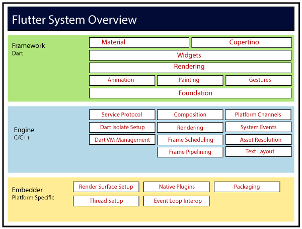

# Flutter Internals

## Flutter Engine

 - Flutter Framework is driven by the Flutter engine frame rendering
    - The exceptions are:
        - Gesture
        - Platform messages
        - Device messages
        - Future or http responses

    - The Flutter Framework will not apply any visual changes without having requested by the Flutter Engine frame rendering.

    - If you want a visual change to happen, or if you want some code to be executed based on a timer, you need to **tell the Flutter Engine** That something to be rendered. Usually, at next refresh, the Flutter Engine will then request the Flutter Framework to run some code and eventually provide new scene to render.

## RenderView and RenderObject

`RenderObject`s are used to: 
  - define some area of the screen in terms of dimensions, position, geometry but alo in terms of ***"rendering content"***
  - identify zones of the screen potentially impacted by the gestures

The set of all `RenderObject`s form a tree, called `RenderTree` and is itself a special version of a `RenderView`.

`RenderView` represents the total output surface of the RenderTree and is itself a special version of a RenderObject.

## The Bindings - Introduction

The `bindings` are meant to be some kind of glue between the Flutter Engine and the Flutter Framework. It is only through these bindings that data can be exchanged between the two Flutter parts(Engine and Framework)

Each `binding` is responsible for handling set of specific tasks, actions, events, regrouped by domain of activities.

**Flutter Framework bindings**:
- **SchedulerBinding**
    - Tell the Flutter Engine: "Next time you are not busy, wake me up so that I can work a bit and tell you either what to render or if I need you to call me again later"
    - Listen and react to such "wake up calls"
- **GestureBinding**
    - Listens to interactions with the Engine in terms of "finder" (=gesture)
- **RendererBinding**
    - Listen to events, emitted by the Engine, to inform about changes applied by the user via the device settings, which impact the visuals and/or the semantics
    - To provide the Engine with the modifications to be applied to teh display.
- **WidgetsBinding**
    - Listens to changes applied by the user via the device settings, which impact the language and semantics
    - Drive the process in charge of handling the Widgets structure changes. The handling of the Widgets Structure changes is done via the `BuildOwner`(tracks which widgets need rebuilding, and handles other tasks apply to widget structures as a whole). 
    - To trigger the rendering
- **ServiceBinding** - responsible for handling messages sent by the `platform` channel
- **PaintingBinding** - responsible for handling the image cache
- **SemanticsBinding** - reserved for later implementation of everything related to ***Semantics***
- **TestWidgetsFlutterBinding** - used by widgets tests library

## Element Tree

To each widget corresponds on element. Elements are linked to each other and form a tree. Therefore an element is a reference of something in the tree.

 - Elements are created by the widgets
 - Element references the Widget that created it
 - Elements are linked together with the parent relationships
 - Elements could have a child or children
 - Elements could also point to a RenderObject

 `Elements` define how parts of the visuals are linked to each other

## 3 main categories of widgets

- the `proxies` - the main role of these Widgets to hold some piece of information which needs to be made available to the Widgets, part of the tree structure, rooted by the proxies. A typical example of such Widgets is the InheritedWidget or LayoutId. These widgets do not directly take part of the User Interface but are used by others to fetch the information they can provide.

- the `renderers` - have a direct involvement with the layout of the screen as they define (or are used to infer) either: 
    - the dimensions
    - the position
    - the layout, rendering

Examples: Row, Column, Stack, Padding...

- the `components` - These are other Widgets which are not directly providing the final information related to dimensions, positions, look but rather data which will be used to obtain the final information. These Widgets are commonly named components.

Examples: ElevatedButton, Scaffold, GestureDetector...

Element Types: 
 - Component Element - elements do not directly correspond to any visual rendering part

 - RenderObjectElement - these elements correspond to a part of the rendered screen

## How do Widgets and Elements work together? 

- I Flutter, the whole mechanism relies on **invalidating** either and element or a renderObject

Invalidation of element:
- by using setState, which invalidates the whole StatefulElement
- via notifications, handled by other proxyElement, which invalidates any element that depends on that proxyElement

The outcome of an invalidation is that corresponding elements is referenced in a list of dirty elements.

Invalidating a renderObject means that no changes are applied to the structure of the elements but a modification at the level of a `renderObjects` happens such as:
- Changes to its dimensions, position, geometry...
- Needs to be repainted, for example when you simply change the background color, the font style...

Whenever invalidation happens, the `SchedulerBinding` is requested to ask the FlutterEngine to schedule a new frame.

## [addPostFrameCallBack](https://api.flutter.dev/flutter/scheduler/SchedulerBinding/addPostFrameCallback.html) method

- Schedule a callback from the end of this frame. 

## References

[www.didierboelens.com](https://www.didierboelens.com/2019/09/flutter-internals/)
